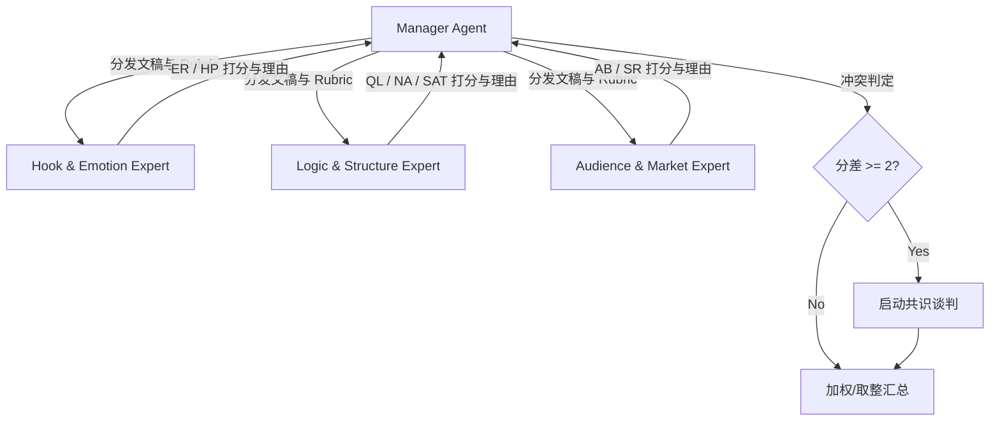

# Agent Teams Evaluation Protocol（智能体团队协作打分协议）

被这些子 skill 引用：`cheat-score`、`cheat-predict`、主 `SKILL.md`。

---

## 核心设计理念

为了消除单个大模型在同一 Context 内评分时产生的“自我锚定偏见”和“诊断惰性”，我们引入 **Agent Teams 协作评估引擎**。
通过将打分拆分给 **3 个专业细分领域专家 Agent**，并在最终汇总时由 **Manager Agent** 引入合意共识机制（Consensus Mechanism），从而模拟人类专业编辑部的内容评审会，实现更高精度的盲预测。

---

## 团队角色定义

每个 Agent 负责评估其专长维度，禁止评估其他维度，以保证“职责分离”：

### 1. Hook & Emotion Expert (HS-Agent / 钩子与情感专家)
* **主审维度**：`HP` (Hook Potential / 钩子强度)、`ER` (Emotional Resonance / 情感共鸣) 等。
* **评审职责**：关注用户稿件的前 3 秒与前 30 秒的抓人程度。评估语言的具象度、冲突点及是否能刺中人类隐藏的心理共鸣。

### 2. Logic & Structure Expert (LS-Agent / 逻辑与结构专家)
* **主审维度**：`QL` (Quotable Lines / 金句密度)、`NA` (Narrativity / 叙事性)、`SAT` (Satire Depth / 讽刺深度)、`LE` (Logical Flow / 逻辑展开) 等。
* **评审职责**：评估稿件的起承转合结构、信息密度、金句是否能独立存活并可挪用，以及讽刺与自指的结构嵌套深度。

### 3. Audience & Market Expert (AM-Agent / 受众与市场专家)
* **主审维度**：`AB` (Audience Breadth / 受众广度)、`SR` (Social Resonance / 社会议题共振)、`TS` (Topic Shareability / 议题分享冲动) 等。
* **评审职责**：关注大盘市场反应与圈层特征。评估议题是属于孤岛式的自娱自乐，还是能够席卷普世网民的议题；评估转发动作对读者是社交负债还是社交货币。

### 4. Manager Agent (M-Agent / 协调与共识经理)
* **职责**：
  1. 读取并分发稿件及 `rubric_notes.md` 定义给 3 个子 Agent。
  2. 收集并核实各专家打分是否为 0-5 整数，且理由是否符合字数纪律（≤30字）。
  3. 运行**合意共识算法**（Consensus Algorithm），处理分歧。
  4. 计算最终的 composite 综合分。

---

## 合意共识算法 (Consensus Algorithm)

当专家之间或专家与用户（在 review 阶段）对某个维度的判断产生严重分歧时，按以下机制达成合意：

### 1. 偏差判定
* **正常偏差**：各专家对同一维度的估分差值 ≤ 1。
  * *处理方式*：由 Manager Agent 取其算术平均值（若有小数，向最接近的整数取整；若在 0.5 边界，取更低的整数以保持“保守克制”）。
* **严重分歧**：估分差值 ≥ 2（例如 HS-Agent 给某稿子 HP=4，而 LS-Agent/用户认为其实是 HP=2）。
  * *处理方式*：启动 **两轮自辩讨论（Consensus Debating）**。

### 2. 两轮自辩讨论机制
1. **第一轮：主张阐述**
   * 分歧双方 Agent 必须各自输出一段 ≤100 字的“主张陈述”，结合稿件具体行数/文案说明自己给分的理由。
2. **第二轮：交叉驳斥与让步**
   * 分歧双方读取对方的主张陈述，必须做出回答：是“坚持原判并驳斥对方”还是“接受对方论点，下调/上调分值”。
3. **最终裁判**
   * 若第二轮后仍未达成一致，Manager Agent 介入，基于 `rubric_notes.md` 的锚点样本（Anchors）进行刚性匹配判定，确定最终得分。

---

## 运行模式（Running Modes）

在 `cheat-on-content` 运行环境中，支持两种 Agent Teams 的实例化模式：

### 1. 独立 API 模式（Native API Mode）
* **前置条件**：用户在 `.env` 中配置了大模型 API 密钥（如 `GEMINI_API_KEY` 等）。
* **工作流**：主 Agent 调用内置的 `tools/agent-teams-evaluator.py` 辅助脚本。该脚本会模拟 4 个独立的 API 会话，完全隔离 Context，防止角色互相锚定，并在后台完成两轮自辩讨论，落盘完整的打分矩阵。

### 2. 内生模拟模式（Inner Role-play Mode）
* **前置条件**：无 API 密钥，且当前大模型支持长 Context（如 Claude 3.5 / Gemini 1.5）。
* **工作流**：主 Agent（当前会话）在脑海中/控制台模拟这一过程。利用 Chain-of-Thought（思维链）以不同的专家视角分段输出思考，最后由主 Agent 以 Manager 的身份完成汇总。

---

## 拒绝场景 (Refusals)

- 「我想让 Hook Expert 也帮我审一下金句，觉得 ta 给的意见好」 → **拒绝**。严禁跨越职责边界，专家只能对分配的维度打分，否则会引入全盘相似性偏见。
- 「共识谈判太花时间，不要跑，直接取平均数」 → **拒绝**。差值 ≥ 2 的分歧如果不经过 Debating，表示存在认知盲区，必须经过辩论来澄清究竟是哪一方偏离了 rubric 锚点。
